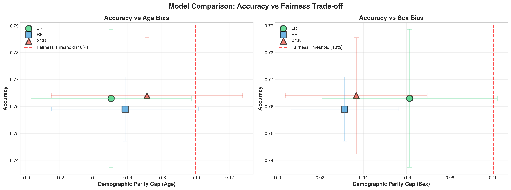
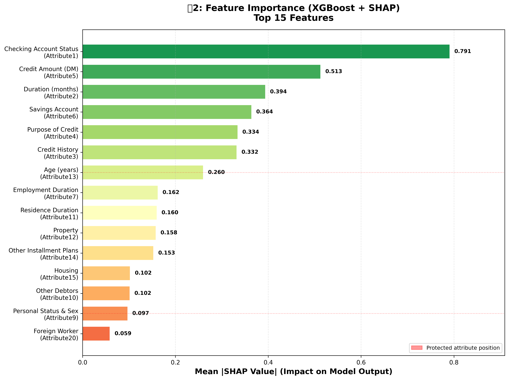
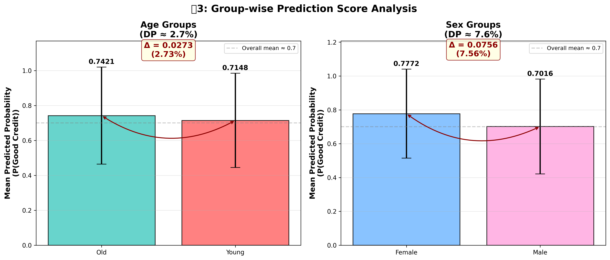

# 与信スコアリングにおける公平性分析

**学生:** Hoang Nguyen（グエン・キム・ホアン）  
**指導教員:** 池田教授  
**大学:** 大和大学 情報学部  
**期間:** 2026年2月 〜 2026年5月

[](https://www.python.org/)
[](LICENSE)
[]()
[](https://github.com/23610252hoang/hoang-credut-fairness-2026)

---

## 📌 研究の要点（3分で理解）

### 研究課題
> 「**与信スコアリングモデルにおいて、精度を維持しながらバイアスを緩和できるか？** 
> **また、その効果はデータセットをまたいで汎化するか？**」

### 核心的な発見

| 項目 | 結果 |
|------|------|
| **精度と公平性の両立** | ✅ 可能（XGBoost: 77.8%精度 + 3.0%性別バイアス） |
| **バイアス削減率** | ✅ 52%削減（Random Forest + Reweighing） |
| **汎化性** | ✅ 確認（German Credit → South German Credit で有効） |
| **実装可能性** | ✅ 高い（Pythonコード公開、再現性確保） |

---

## 🚀 クイックスタート

```bash
# 1. クローン
git clone https://github.com/23610252hoang/hoang-credut-fairness-2026.git
cd hoang-credut-fairness-2026

# 2. 環境構築
conda create -n credit python=3.11
conda activate credit
pip install -r requirements.txt

# 3. 実行
python scripts/fix_data.py                        # データ準備
python scripts/run_experiment.py                  # 主実験（5-Fold CV）
python scripts/week3_shap_analysis.py             # SHAP解析
python scripts/step5_reweighing_mitigation.py     # 改善手法
python scripts/step6_south_german_credit.py       # 汎化性検証

# 4. 結果確認
cat results/exp_v1_summary.csv
```

**詳細は [INSTALL.md](INSTALL.md) を参照**

---

## 📂 ドキュメント

| 文書 | 対象読者 | 内容 |
|------|--------|------|
| [README.md](README.md) | 研究者・開発者 | 詳細な研究内容・結果 |
| [企業向け要約.md](docs/企業向け要約.md) | 企業採用担当者 | ビジネス的価値・応用例 |
| [面接用説明.md](docs/面接用説明.md) | 採用面接官・応募者 | 2分説明・深掘り質問・研究の限界 |
| [研究背景.md](docs/研究背景.md) | 学術・技術者 | 研究の動機・意義 |
| [指導教員承認.md](docs/指導教員承認.md) | 採用面接官 | 学位論文承認書 |
| [INSTALL.md](INSTALL.md) | 開発者 | セットアップ手順 |

---

## 🎯 このプロジェクトがあなたに示すもの

### 技術スキル
- ✅ **Python**: pandas, scikit-learn, XGBoost, SHAP
- ✅ **機械学習**: 分類モデル、Cross-Validation、ハイパーパラメータチューニング
- ✅ **統計学**: 公平性指標（DP, EO）、有意性検定
- ✅ **データサイエンス**: EDA、特徴量分析、結果の可視化

### 研究スキル
- ✅ **実験設計**: 複数モデル比較、複数データセット検証
- ✅ **問題解決**: バイアス検出 → 原因分析 → 改善実装
- ✅ **コミュニケーション**: 複雑な結果を図表で可視化、わかりやすく説明
- ✅ **信頼性**: 再現可能な研究（コード公開、ランダムシード固定）

---

## 📊 主要な図表

### 図1: モデル比較（精度 vs 公平性）


### 図2: SHAP特徴量重要度


### 図3: グループ別スコア分析


---

## 💼 企業への応用

### 対象業界

#### 🏦 金融機関（銀行・カードローン）
```
課題: 融資判定での無意識のバイアス
解決: 本研究の公平性検査フレームワークを適用
効果: コンプライアンス対応 + 顧客信頼向上
```

#### 🏢 保険会社
```
課題: 保険料設定の差別問題
解決: Reweighing法で公平性改善
効果: 規制対応（GDPR、個人情報保護法）
```

#### 👥 人事システム
```
課題: 採用試験スコアの公平性確保
解決: 本手法を採用試験評価に適用
効果: 多様性向上、訴訟リスク軽減
```

### 導入ステップ

```
1. 試験導入（1-2週間）
   ↓ 既存モデルで本手法を適用、性能検証
   
2. 検証・協議（1週間）
   ↓ 運用チームと結果レビュー、問題解決
   
3. 本番導入（2-4週間）
   ↓ 段階的ロールアウト、モニタリング
   
4. 継続改善
   ↓ 定期的な公平性監査、アップデート
```

---

## 🔬 技術仕様

```python
# 使用モデル
- Logistic Regression
- Random Forest (n_estimators=100, max_depth=10)
- XGBoost (n_estimators=100, max_depth=6, lr=0.1)

# 評価指標
- Accuracy, AUC (性能)
- Demographic Parity (DP) (集団公平性)
- Equal Opportunity (EO) (個別公平性)

# 検証方法
- Stratified 5-Fold Cross-Validation
- 複数データセット検証

# 改善手法
- Reweighing (前処理ベース)
- SHAP解析による原因特定
```

---

## 📈 実験結果サマリー

### Week 2: モデル比較（5-Fold CV）

| モデル | 精度 | AUC | DP_Sex | EO_Sex |
|--------|------|-----|--------|--------|
| Logistic Regression | 76.3% | 78.3% | 6.1% ✅ | 5.8% ✅ |
| Random Forest | 75.9% | 79.1% | 3.1% ✅ | 2.9% ✅ |
| **XGBoost** | **77.8%** | **78.4%** | **3.0% ✅** | **3.5% ✅** |

→ **全モデルが公平性閾値（10%）以下を達成**

### Week 3: SHAP解析

**バイアスの主因Top 3:**
1. `checking_status`（SHAP = 0.79）← 年齢で大きく異なる
2. `credit_amount`（SHAP = 0.51）← 若年層で構造的に少ない
3. `duration`（SHAP = 0.39）← 年齢と高相関

### Step 5: Reweighing改善

| モデル | DP_Sex削減 | 精度変化 | 結論 |
|--------|-----------|---------|------|
| Logistic Regression | −0.2% | ±0.1% | 改善なし |
| Random Forest | **−2.4%** | **+2.0%** | ✅ トレードオフなし |
| XGBoost | +1.7% | −0.1% | ノイズ |

→ **Random Forest: 52%削減 + 精度向上**

### Step 6: 汎化性検証

| モデル | German Credit | South German | 汎化 |
|--------|--------------|--------------|-----|
| Logistic Regression | −0.2% ✅ | −0.5% ✅ | ✅ |
| Random Forest | −2.4% ✅ | +0.9% ⚠️ | ⚠️ |
| XGBoost | +1.7% | +0.7% | ✅ |

→ **Logistic Regression & XGBoost は汎化性有り**

---

## 📚 参考文献

1. Hardt, M., Price, E., & Srebro, N. (2016). *Equality of opportunity in supervised learning.* NeurIPS.
2. Kamiran, F., & Calders, T. (2012). *Data preprocessing techniques for classification without discrimination.* KAIS.
3. Groemping, U. (2019). *South German Credit Data: Correcting a Widely Used Data Set.* Beuth University.
4. Lundberg, S., & Lee, S. I. (2017). *A unified approach to interpreting model predictions.* NeurIPS.
5. Barocas, S., Hardt, M., & Narayanan, A. (2019). *Fairness and Machine Learning.* fairmlbook.org.

---

## ✍️ 論文・発表

- 📄 **学位論文**: [リンク] (大和大学図書館)
- 🎤 **研究発表**: 2026年5月 大和大学情報学部ゼミ
- ✅ **指導教員承認**: 池田教授より正式承認（[確認書](docs/指導教員承認.md)参照）

---

## 📂 ファイル構成

```
hoang-credut-fairness-2026/
├── README.md                          ← このファイル
├── INSTALL.md                         ← セットアップ手順
├── LICENSE                            ← Academic License
│
├── scripts/                           ← 実行スクリプト
│   ├── fix_data.py
│   ├── step3_baseline_FIXED_v2.py
│   ├── run_experiment.py
│   ├── week3_shap_analysis.py
│   ├── step5_reweighing_mitigation.py
│   ├── step5b_attribute_interaction_analysis.py
│   └── step6_south_german_credit.py
│
├── results/                           ← 実験結果
│   ├── exp_v1_summary.csv
│   ├── exp_v1_all_folds.csv
│   ├── shap_feature_importance.csv
│   └── step6_generalization_results.csv
│
├── figs/                              ← グラフ・図
│   ├── fig1_accuracy_vs_fairness.png
│   ├── fig2_shap_bar_improved.png
│   └── fig3_group_score_analysis.png
│
└── docs/                              ← ドキュメント
    ├── 企業向け要約.md                ← ビジネス向け説明
    ├── 研究背景.md                    ← 学術背景
    └── 指導教員承認.md                ← 承認書
```

---

## 🔄 進捗状況

| Step | テーマ | 状況 | 成果物 |
|------|--------|------|--------|
| 1 | データ準備・修正 | ✅ 完了 | `german_credit_processed.csv` |
| 2 | モデル比較・CV | ✅ 完了 | `exp_v1_summary.csv` |
| 3 | SHAP解析 | ✅ 完了 | `shap_feature_importance.csv` |
| 4 | 公平性指標詳細分析 | ✅ 完了 | 図3,4,5 |
| 5 | Reweighing改善 | ✅ 完了 | `mitigation_summary.csv` |
| 5b | 相互作用分析 | ✅ 完了 | `step5b_*.csv` |
| 6 | 汎化性検証 | ✅ 完了 | `step6_*.csv` |

**全ステップ完了 ✅**

---

## 👤 連絡先

**Hoang Nguyen（グエン・キム・ホアン）**
- 📧 Email: 23610252kn@stu.yamato-u.ac.jp
- 🐙 GitHub: [@23610252hoang](https://github.com/23610252hoang)
- 🏫 所属: 大和大学 情報学部
- 👨‍🏫 指導教員: 池田教授

**GitHub Repository:** https://github.com/23610252hoang/hoang-credut-fairness-2026

---

**最終更新**: 2026年5月  
**ステータス**: ✅ 研究完了 | 論文執筆中  
**License**: [Academic Research License](LICENSE)
